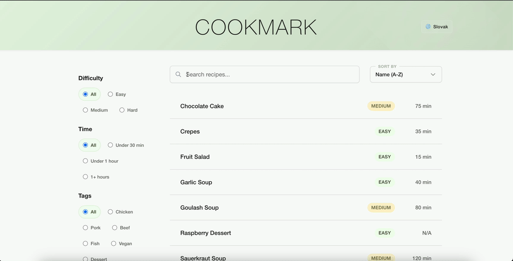

# Cookmark 🍳

A modern, responsive recipe book web application built with SolidJS/SolidStart.

<p align="center">
  
</p>

## ✨ Features

- **Fuzzy Search** - Find recipes quickly with intelligent search across titles, ingredients, and tags
- **Advanced Filtering** - Filter by difficulty level, cooking time, and tags
- **Static Site Generation** - Optimized for deployment on GitHub Pages

## 🚀 Quick Start

### Prerequisites

- Node.js 22+ and npm installed on your system

### Development

1. Clone the repository:
```bash
git clone https://github.com/yourusername/cookmark.git
cd cookmark
```

2. Install dependencies:
```bash
npm ci
```

3. Start the development server:
```bash
npm run dev 
```

4. Open your browser and navigate to `http://localhost:3000/cookmark`

### Building for Production

Build the static site for GitHub Pages deployment:

```bash
npm run build
```

The built files will be in the `.output` directory, ready for deployment.

## 📦 Use as Template

Want to create your own recipe book? Use degit to scaffold a new project from this template:

```bash
npx degit yourusername/cookmark my-recipe-book
cd my-recipe-book
npm install
```

## 📝 Adding Recipes

Recipes are stored in `src/data/recipes/` as TypeScript files. Each recipe follows a structured format:

```typescript
export const myRecipe: Recipe = {
  slug: "my-recipe",
  difficulty: "easy",
  prepTime: 15,
  cookTime: 30,
  servings: 4,
  tags: ["vegetarian", "quick"],
  // Additional fields defined per locale
}
```

## 🚢 Deployment

This project is designed to be deployed as a static site on GitHub Pages. Check [deploy script](./.github/workflows//deploy.yml) to see how it can be deployed.

## 🤝 Contributing

Contributions are welcome! Feel free to submit issues and pull requests.

## 📄 License

MIT License - feel free to use this project for your own recipe collection!
